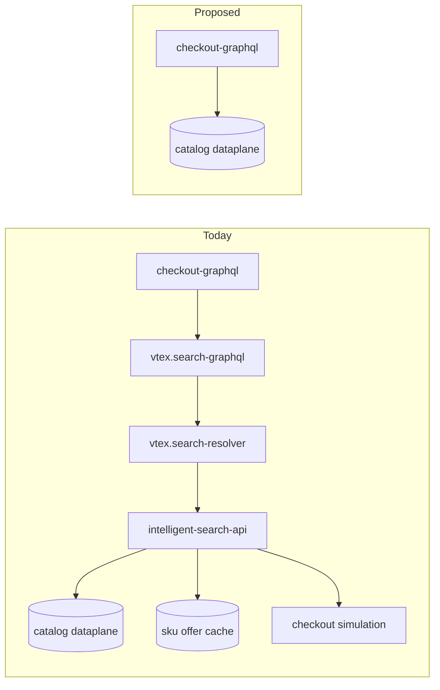
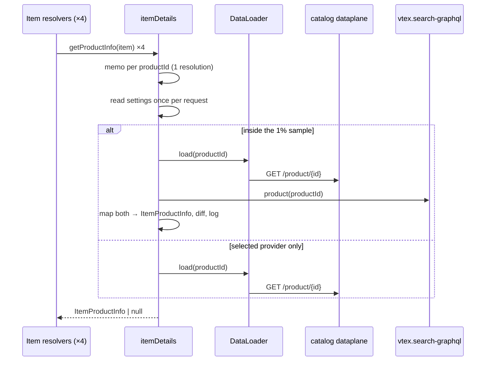

# Cart item details straight from the catalog dataplane

> **Status**: Approved
> **Created**: 2026-08-14

## 1. Business Context

### Problem Statement

Four fields on a cart `Item` do not come from the order form. `name`, `skuName`,
`skuSpecifications` and `productSpecificationGroups` are catalog text, and today
checkout-graphql fetches them through a chain of four services:

```
checkout-graphql → vtex.search-graphql → vtex.search-resolver → intelligent-search-api → catalog dataplane
```

Every one of those hops adds a timeout, a retry policy, a deploy cadence and an
error budget to the cart's critical render path, and the text itself only exists
in the last one. The three intermediate services exist to answer a storefront's
question — *what should a shopper browsing a catalog be shown, at what price, in
which sales channel* — which is not the question a cart asks. A cart already
holds the item. It knows the quantity, the price, the seller and the availability
that were agreed when the item was added; every monetary value on `Item` comes
from the order form. All it needs from the catalog is text.

Two facts make the shortcut available. First, checkout always looks products up
by `productId` — never by slug, EAN, reference or SKU — and the catalog dataplane
document is keyed by exactly that. Second, the work the intermediate services do
on top of that document is work the cart discards: `intelligent-search-api`
fetches a second document (the per-SKU offer cache) to decide availability,
validates the product against a sales channel and a visibility flag, and unless
told to skip, runs one checkout price simulation per SKU per seller. The cart
reads none of those results.

The cost is paid on every cart render, for every distinct product in the cart,
and it is paid twice over on the failure path: when any hop in the chain is slow
or down, all four fields silently degrade to order-form values, so a shopper sees
the SKU name their cart was created with instead of the catalog's current text.
Shortening the chain from four hops to one removes three sets of failure modes
and three sets of latency, and stops asking the platform to compute availability
and prices that get thrown away.

### Goals

- Resolve the four catalog fields from a single upstream request per distinct
  product, replacing a four-hop chain with one hop.
- Stop the platform from doing work the cart discards: no per-SKU price
  simulation, no per-SKU offer document, no sales-channel or visibility
  validation.
- Keep what the shopper sees identical, and prove it on production traffic
  before cutting over, rather than asserting it.
- Narrow the request to the only two inputs that can change the answer
  (`productId` and locale), so the memory cache stops fragmenting on inputs that
  cannot.
- Preserve the existing soft-failure contract: a cart never fails to render
  because the catalog is unavailable.

### User Stories

#### US-1: Shopper sees the catalog's current text for their cart items

- **Story**: As a shopper, I want each cart item to show the product and SKU name
  and specifications the catalog holds today, so that the cart matches the
  product page I bought from.
- **Acceptance Criteria**:
  - **Given** a cart with items, **when** the cart is queried, **then** `name`,
    `skuName`, `skuSpecifications` and `productSpecificationGroups` hold the same
    values they hold today through `vtex.search-graphql`.
  - **Given** a shopper whose segment carries a `cultureInfo`, **when** items
    resolve, **then** the text arrives in that locale, translated by the
    dataplane exactly as it is today.
  - **Given** a product whose text cannot be resolved, **when** the cart is
    queried, **then** each field falls back to its order-form value and the cart
    still renders.

#### US-2: Cart renders with one upstream hop instead of four

- **Story**: As a shopper, I want the cart to render as fast as the catalog can
  answer, so that I am not waiting on services that add nothing to the answer.
- **Acceptance Criteria**:
  - **Given** a cart with N items across M distinct products, **when** all four
    fields are queried, **then** exactly M upstream requests are made, no matter
    how many items share a product or how many fields are selected.
  - **Given** a cart render, **when** item details resolve, **then** no request
    reaches `vtex.search-graphql`, `vtex.search-resolver` or
    `intelligent-search-api`.
  - **Given** two carts in the same process asking for the same product in the
    same locale, **when** the second resolves, **then** it is served from the
    client's memory cache.

#### US-3: Operator can roll back without a deploy

- **Story**: As an operator, I want to switch item details back to
  `vtex.search-graphql` without deploying, so that a bad interaction with the
  catalog is a configuration change and not an incident.
- **Acceptance Criteria**:
  - **Given** `useCatalogDataPlaneForItemDetails` is `false` or unset, **when**
    items resolve, **then** they resolve through `vtex.search-graphql` exactly as
    today.
  - **Given** the setting cannot be read, **when** items resolve, **then** the
    app falls back to `vtex.search-graphql` rather than to the new path.
  - **Given** a workspace and the `x-vtex-force-catalog-dataplane-item-details`
    header, **when** a request carries it, **then** the new path is used for that
    request regardless of the setting.

#### US-4: The platform stops computing what the cart throws away

- **Story**: As a platform engineer, I want the cart to stop triggering price
  simulations, offer lookups and storefront validation it does not read, so that
  the load exists only where it is used.
- **Acceptance Criteria**:
  - **Given** the new path is enabled, **when** an item resolves, **then** no
    checkout simulation is triggered on its behalf and no per-SKU offer document
    is fetched.
  - **Given** an item whose product is hidden, or absent from the shopper's
    sales channel, or has no available SKU, **when** it resolves, **then** the
    catalog text is returned rather than a 404, because the shopper already holds
    the item.

#### US-5: Engineer has evidence the providers agree before cutting over

- **Story**: As the engineer rolling this out, I want measured proof that the new
  path returns what the old one returns, so that enabling it is a decision backed
  by production data.
- **Acceptance Criteria**:
  - **Given** the fixed 1% production comparison sample rate, **when** a
    product's details are resolved, **then** roughly 1% of distinct products are
    fetched from both providers and the remaining 99% from the selected provider
    only.
  - **Given** a workspace that is not production, **when** a product's details
    are resolved, **then** every distinct product is fetched from both providers
    and compared, so a difference can be reproduced by opening a cart.
  - **Given** a product is sampled, **when** the two results are compared,
    **then** the comparison runs on the normalized `ItemProductInfo` each
    provider's mapper produces, never on the two raw upstream payloads.
  - **Given** a sampled product whose results differ, **when** the comparison
    runs, **then** an error-level log names the `productId` and the path of each
    difference, and the shopper still receives the selected provider's result.
  - **Given** a product is sampled, **when** either provider fails, **then** the
    shopper receives the result of whichever succeeded and no difference is
    reported.
  - **Given** a product outside the sample, **when** it resolves, **then** no
    shadow request is made and no latency is added.

### Key Scenarios

| Scenario | Pre-conditions | Steps | Expected Result |
|---|---|---|---|
| Happy path | Flag on; cart with one item; product has 3 active SKUs | Query the four fields | One `GET /api/catalog-dataplane/product/{productId}`; `name` from the document's `name`, `skuName` from the matching SKU, `skuSpecifications` from that SKU's variations, `productSpecificationGroups` from the document's specification groups |
| Repeated product | Flag on; 5 items across 2 distinct products | Query the four fields on every item | 2 requests, not 20 |
| Localized shopper | Flag on; segment `cultureInfo: en-US` | Same query | Request carries `Accept-Language: en-US`; the response's translated text is served; a `pt-BR` request for the same product does not hit the same cache entry |
| Bundle item | Item has no `productId` | Same query | No request is made; all four fields fall back to order-form values |
| Product missing from the catalog | Flag on; dataplane answers 404 | Same query | Fields fall back to order-form values; one sampled warning distinguishing "not found" from a transport error |
| Dataplane unavailable | Flag on; request times out | Same query | Same fallback; sampled warning naming the dataplane as the upstream |
| Flag off | Setting absent | Same query | Resolved through `vtex.search-graphql`, byte-for-byte today's behavior |
| Inactive SKU | Product has an SKU with `isActive: false` | Same query | That SKU is absent from `items`, so it cannot supply a `skuName` — matching what search returns today |
| Product hidden after being added | Product has `isVisible: false` | Same query | All four fields resolve; there is no visibility gate to trip |
| Product outside the segment's sales channel | Segment `channel` differs from the cart's | Same query | Fields resolve from the catalog; today they fall back to order-form text because search 404s |
| Product with unavailable SKUs | Some SKUs have no stock, and carry SKU-level specification groups | Same query | Their specifications appear in `productSpecificationGroups`; today they are filtered out. The one deliberate divergence, quantified by the comparison |
| Subscription SKU | SKU has a `vtex.subscription.*` attachment | Same query | `skuSpecifications` includes an `activeSubscriptions` entry, as it does today |
| Large cart | Flag on; 40 items across 40 distinct products | Same query | Concurrency cap of 10 bounds in-flight requests; no retries amplify the fan-out |
| Sampled for comparison | Flag off; product falls inside the 1% sample | Same query | Both providers called once; the shopper is served the `searchGraphQL` result; the normalized results are compared and the outcome logged |
| Not sampled | Flag off; product outside the sample | Same query | Only `searchGraphQL` is called; no comparison log; no added latency |
| Sampled, results differ | Sampled; the dataplane yields a different SKU name | Same query | Error log with the difference at `items[itemId:{id}].name`; the shopper still receives the selected provider's value |
| Sampled, shadow fails | Sampled; the non-selected provider times out | Same query | No difference logged; the shopper receives the selected provider's result |
| Sampled four times over | Sampled; one product, all four fields queried | Same query | Exactly one comparison, not one per field |

### Functional Requirements

1. Fetch product text with `GET /api/catalog-dataplane/product/{productId}`,
   once per distinct `productId` per request.
2. Send the locale as `Accept-Language`, derived from `segment.cultureInfo`, then
   `ctx.vtex.locale`, then `tenant.locale`. Send nothing else that varies per
   shopper — no sales channel, no region, no segment token.
3. Authenticate with the app's own token, since the dataplane path is not public.
4. Map the document to a normalized `ItemProductInfo` that reproduces what
   `intelligent-search-api` produces today for these four fields:
   - `items` from SKUs with `isActive === true`, in document order.
   - Each item's `variations` from that SKU's specification groups — every
     specification with at least one value, as `{ name, values }` — followed by
     an `activeSubscriptions` variation when the SKU carries `vtex.subscription.*`
     attachments.
   - `specificationGroups` from the SKU-level groups first and then the
     product-level groups, dropping specifications whose field is
     `isOnProductDetails: false`, excluding specifications whose field is
     `isSkuField`, dropping specifications with no non-empty value, and dropping
     groups left with nothing.
   - A synthetic `allSpecifications` group appended last, carrying every
     specification that survived the visibility filter — SKU fields included —
     with values merged and deduplicated in the order the groups were visited.
5. Never throw: return `null` for an item without a `productId`, for a product
   that does not resolve, and on any upstream error, leaving each resolver to
   fall back to its order-form value.
6. Select the provider from the `useCatalogDataPlaneForItemDetails` app setting,
   read once per request, defaulting to `vtex.search-graphql`.
7. On a fixed 1% of distinct products in production, and on every one of them
   outside it, resolve through *both* providers, compare the two normalized
   results and log the outcome. Always serve the selected provider's result; the
   shadow result is only ever compared and discarded.
8. Compare after mapping, never before, so the diff reports behavioral
   divergence rather than the unavoidable differences between two payload
   formats.
9. Compare arrays by identity rather than position (`items` by `itemId`,
   `specificationGroups` and `variations` by `name`), because neither upstream
   guarantees ordering. Leaf `values` arrays are compared positionally, because
   their order is what the cart renders.
10. Log a 404 distinctly from a transport failure, so a gap in the catalog is
    measurable separately from an unhealthy upstream.

### Non-Functional Requirements

- **Latency**: 3s timeout, matching the client it replaces. One hop should
  measurably beat four; the `checkout-catalog-dataplane-product` metric is what
  proves it.
- **Fan-out**: one request per distinct product, so `retries: 0` and a
  concurrency cap of 10 — a retry would multiply an already fanned-out call.
- **Cache**: a 5000-entry process memory cache. Its key must discriminate locale
  and account, or a multi-binding account will serve one locale's text to
  another.
- **Comparison cost**: at 1%, the shadow path adds roughly 1% to each provider's
  volume, and a sampled product resolves as slowly as the slower provider.
  Non-sampled resolutions make exactly one upstream call. Outside production
  every resolution pays the shadow request, which is affordable only because a
  workspace's traffic is one developer's.
- **Capacity**: the dataplane currently serves internal callers. Cart render
  traffic is new load on it and needs the catalog team's agreement before the
  flag is enabled beyond a test account.
- **Observability**: a dedicated metric name; the sampled failure warning must
  name the dataplane rather than `vtex.search-graphql`.
- **Log volume**: one line per sampled product, first 10 differences only.
  Comparison logs carry `productId` and `locale` — never payloads, never shopper
  data.

### Out of Scope

- Prices, promotions, availability, images and every other `Item` field. They
  come from the order form and stay there.
- The search-driven paths in other apps. This changes how a *cart* reads catalog
  text, nothing about search, PDP or shelves.
- Removing `vtex.search-graphql`, its client and the `vtex.graphql-server`
  dependency. That is Phase 7, after the flag is at 100%.
- Batching several products into one upstream request. The dataplane document
  endpoint is per-product; a batch endpoint would be a separate change.
- Changing the GraphQL schema. The four fields keep their types and semantics.

---

## 2. Arch Decisions

### Proposed Solution

Add a client for the catalog dataplane's product document and a mapper that
turns that document into the same normalized shape the `searchGraphQL` path is
mapped into. Both providers become mappers onto one `ItemProductInfo`; the
resolvers read only that shape, so they no longer know which upstream answered.



The normalized shape is also what makes the rollout verifiable: because both
providers produce `ItemProductInfo`, a sampled percentage of products can be
resolved through both and diffed, and any difference is a real behavioral
difference rather than an artifact of two payload formats.

Components:

1. **`node/clients/catalogDataPlane.ts`** — a `JanusClient` performing
   `GET /api/catalog-dataplane/product/{productId}`. `JanusClient` supplies the
   portal host and the `an={account}` parameter; the client adds the locale
   headers, the app token and the metric name.
2. **`node/services/itemDetails.ts`** — a per-request `DataLoader` keyed by
   `productId`, a per-request memo of resolved products, provider selection, and
   the sampled comparison. Created lazily and held per request, not per process.
3. **`node/utils/itemProductInfo.ts`** — the `ItemProductInfo` shape and the two
   mappers onto it, one per provider.
4. **`node/utils/compareResults.ts`** — ported from `search-resolver`: runs two
   async functions in parallel on a sampled percentage of calls, deep-diffs the
   results with identity-based array matching, logs the outcome, and returns the
   first function's result.
5. **`node/services/settings.ts`** — reads `useCatalogDataPlaneForItemDetails`
   from `apps.getAppSettings`, with a header escape hatch for testing.
6. **`manifest.json`** — the `settingsSchema` for that setting and
   `outbound-access` policies for `/api/catalog-dataplane/*` on both portal
   hosts.



### Alternatives Considered

| Alternative | Pros | Cons | Verdict |
|---|---|---|---|
| Keep `vtex.search-graphql` (status quo) | No work; one code path | Four hops for text that lives in one document; pays for simulation and offer lookups the cart discards | Rejected — the cost is on every cart render |
| Call `intelligent-search-api` directly (the alternative in PR #221) | Two hops instead of four; reuses IS's mapping, so `specificationGroups` and `variations` are formatted upstream; inherits its 404 semantics | Still fetches the per-SKU offer document and still validates sales channel, visibility and availability — all discarded by the cart; still an extra service in the path | Rejected in favour of one hop, but kept as the fallback if the dataplane cannot be reached or cannot take the traffic |
| Dataplane document **plus** the SKU offer document | Exactly reproduces today's availability-filtered `specificationGroups` | Two requests instead of one, reintroducing the lookup this change exists to remove, to fix a divergence that only shows on partially-unavailable products | Rejected; revisit only if the comparison shows the divergence is common |
| Legacy `catalog_system/pub/products/variations/{id}` | Public, no auth question | A different, older shape; more work per request; being superseded by the dataplane | Rejected |
| Read the text from the order form only | Zero upstream calls | The order form holds the text as of when the item was added, so renames and translations never appear | Rejected — that is the fallback, not the answer |

### Risks & Mitigations

| Risk | Impact | Likelihood | Mitigation |
|---|---|---|---|
| The dataplane path is not reachable, or not authorizable, from an IO app through Janus | High — the whole approach is void | Medium | Phase 0 is exactly this question: a linked workspace request before any other code is written. Janus routes `/api/catalog-dataplane/product/{producId}` to `ctgdp-api` in the `core-ingress` namespace, and `recommendation-api` reaches it over a public host, so the route exists; what needs proving is authorization from an app token. If it fails, PR #221's intsch path is the fallback and this spec stops here |
| The dataplane cannot absorb cart-render traffic | High — degrades the catalog for everyone | Medium | Agree the volume with the catalog team before enabling beyond a test account; the flag is per-account, so exposure grows one account at a time; `retries: 0` and the concurrency cap keep a bad cart from amplifying |
| We now own a mapping `intelligent-search-api` owns today, and the two drift | Medium — cart text diverges from PDP text | Medium | The mapping is derived from that service's source, not guessed, and the sampled comparison is running while both paths are live. After cutover the dataplane document is the contract; a change in how IS formats its response no longer concerns the cart, which is part of the point |
| `specificationGroups` is not filtered by SKU availability, where today it is | Low — extra specification values on products with out-of-stock SKUs | High (by construction) | Deliberate; see Decision 4. The comparison measures how often it shows, and the fix (fetching the offer document) is a known, rejected-for-now option |
| Dropping the sales-channel and visibility gates changes which items resolve | Low — strictly more items resolve, with catalog text instead of stale order-form text | Medium | Deliberate; see Decision 3. Both cases 404 today, so the comparison sees a failed shadow rather than a difference, and the change is visible only as fewer fallbacks |
| Locale travels in a header, and `@vtex/api` keys its memory cache on request params plus `x-vtex-locale` only | High — one locale's text served for another on multi-binding accounts | High if unhandled | Send the derived locale as `x-vtex-locale` as well as `Accept-Language`, so the value that reaches the upstream is the value in the cache key. Covered by a test asserting both headers and by a cache-key test |
| The `isActive` rule silently drops SKUs when the field is absent | Medium — a cart item resolves no `skuName` | Low | The rule is copied deliberately (`isActive !== true` drops, matching `unwrap_or(false)` upstream) rather than inverted, and is pinned by a test. Fixtures come from real payloads where the field is present |
| Comparison noise drowns the signal | Medium — the rollout gate becomes meaningless | Medium | Identity-based array matching; an `ignoredDifferences` list that starts empty and grows only with a written justification; tune in a workspace with the rate constant temporarily raised |
| The comparison itself breaks the shopper's request | High — cart text lost | Low | The comparator catches per-side failures and returns the surviving result, throwing only when both fail, which lands in the existing soft-failure catch; the diff runs inside its own try/catch |
| Sampling multiplies, because `getProductInfo` is called once per field per item | Medium — 4× the intended shadow traffic | Medium | The comparison lives at the per-request, per-`productId` memoization boundary, not in the resolvers; pinned by a test |

### Key Decisions

#### Decision 1: Fetch the product document from the catalog dataplane, keyed by `productId`

- **Status**: Accepted
- **Context**: The four fields are catalog text. Today they travel through
  `search-graphql`, `search-resolver` and `intelligent-search-api` before
  anything touches the document that actually holds them. Every lookup checkout
  performs is by `productId` — the resolvers receive an order-form item whose
  `productId` is already known — and the dataplane's document endpoint is keyed
  by precisely that. Nothing in the chain is translating an identifier we do not
  already have.
- **Decision**: Call `GET /api/catalog-dataplane/product/{productId}` through a
  `JanusClient` on the portal host, once per distinct `productId` per request.
  The client sends the locale and nothing else that varies per shopper.
- **Consequences**: Three services leave the cart's critical path, along with
  their timeouts, retries and error budgets. The request becomes narrow enough
  that two carts in different sessions asking for the same product in the same
  locale share a memory-cache entry, where today the sales channel fragments it.
  In exchange, checkout takes a direct dependency on a service it has never
  called, whose consumers so far have all been internal; capacity and
  authorization are the two things Phase 0 has to establish, not assume. The
  endpoint is per-product, so a cart with M distinct products makes M requests —
  the same fan-out as today, since `search-resolver`'s batch is also one upstream
  call per product.

#### Decision 2: Reproduce the mapping `intelligent-search-api` performs, rather than inventing one

- **Status**: Accepted
- **Context**: The dataplane document is not shaped like what the resolvers read.
  Between the two sits real logic that lives in `intelligent-search-api`:
  `items[].variations` is built from each SKU's specification groups plus a
  synthetic `activeSubscriptions` entry derived from attachment names;
  `specificationGroups` merges SKU-level and product-level groups, excludes
  fields marked `isSkuField`, drops empty specifications and appends a synthetic
  `allSpecifications` group with deduplicated values. None of that is guessable
  from the document alone, and all of it is visible in the cart today.
- **Decision**: Port that construction, reading it from the service's source
  (`services/search_product/simulation.rs` for variations,
  `intelligent_search/specifications.rs` for groups, `product.rs` for
  subscriptions) rather than inferring it from sample payloads. Keep its
  quirks where they are observable: SKU-level groups are visited *before*
  product-level ones, because that ordering determines the order of merged
  values in `allSpecifications`; variations keep empty-string values while
  specification groups drop them.
- **Consequences**: The cart keeps rendering what it renders today, including the
  parts nobody designed on purpose — an `activeSubscriptions` pseudo-specification
  and an `allSpecifications` pseudo-group. Two copies of this logic now exist,
  and they can drift; the sampled comparison is what would catch that while both
  paths are live. After cutover the drift stops mattering, because the dataplane
  document — not another service's view of it — becomes the contract. The
  quirk-level fidelity is the expensive part of this change and the reason the
  mapper needs fixtures taken from real payloads.

#### Decision 3: Do not replicate the storefront gates

- **Status**: Accepted
- **Context**: Before returning a product, `intelligent-search-api` can answer
  404 for four reasons: the product is not in the requested sales channel, it is
  not visible, it is not active, or it has no available SKU and is not flagged to
  show anyway. Three of those need data the dataplane document either carries
  (`salesChannels`, `isVisible`, `isActive`) or does not (availability, which
  requires the offer document). The current intsch-based proposal already opts
  out of one of them by sending `show-invisible-items=true`, because a shopper
  can add a product and then have the merchant hide it.
- **Decision**: Apply none of these gates. Resolve the text for whatever product
  the cart names. The only filter kept is per-SKU `isActive`, because it decides
  which SKUs appear in `items` and therefore which `skuName` a cart item can
  match.
- **Consequences**: The gates exist to answer "should this shopper be shown this
  product", which is a storefront question. A cart has already answered it — the
  item is in the cart. Skipping them means an item whose product went out of
  stock, out of the sales channel, or out of sight keeps rendering its real name
  instead of the possibly stale order-form text, which is strictly better for the
  shopper. It also means the sales channel is no longer an input at all, which is
  what lets the request narrow to `productId` plus locale. The visible effect
  during the comparison is one-sided: those products 404 on the `searchGraphQL`
  side, so the comparator sees a failed shadow rather than a difference.

#### Decision 4: Do not filter specification groups by SKU availability

- **Status**: Accepted
- **Context**: `intelligent-search-api` builds `specificationGroups` from a
  catalog filtered to *available* SKUs, falling back to all SKUs when none are
  available. Availability there comes from the per-SKU offer document, which is
  the second request this change removes. Reproducing the filter would mean
  fetching that document, cutting the saving in half.
- **Decision**: Build specification groups from all active SKUs. Accept that a
  product with out-of-stock SKUs can carry a few more specification values than
  it does today, and let the comparison quantify how often that happens.
- **Consequences**: This is the only intentional behavioral divergence in the
  change, and it is narrow: product-level groups are unaffected, and SKU-level
  groups only differ when some SKUs are unavailable *and* they carry
  specifications the available ones do not. It is arguably a fix rather than a
  regression, since a cart item whose own SKU sold out currently has its
  specifications dropped from the product's groups. If the comparison shows the
  divergence is common enough to matter, the offer document is a known, costed
  option — deliberately left on the shelf rather than designed in.

#### Decision 5: Send the locale in `Accept-Language` and in `x-vtex-locale`

- **Status**: Accepted
- **Context**: The dataplane reads the locale from `Accept-Language`, not from a
  query parameter. That matters more than it looks, because `@vtex/api` builds
  its memoization and memory-cache key from the request's params plus exactly one
  header, `x-vtex-locale`. A locale carried only in `Accept-Language` is
  invisible to that key, so two shoppers on different bindings would share one
  cache entry and one of them would see the other's language.
- **Decision**: Derive the locale from `segment.cultureInfo`, then
  `ctx.vtex.locale`, then `tenant.locale`, and send it as both
  `Accept-Language` (what the upstream reads) and `x-vtex-locale` (what the cache
  key reads), at request level so it overrides the instance default the framework
  sets from the request context.
- **Consequences**: The value that reaches the upstream is provably the value in
  the cache key, which is the property the cache needs. It costs one redundant
  header. The alternative — a meaningless query parameter added purely to
  discriminate the key — would work too, but sending a parameter the upstream
  ignores in order to fix a client-side cache is the kind of thing that outlives
  its explanation. Both headers are asserted in tests, because the failure mode
  is silent, locale-dependent, and would surface as a bug report about the wrong
  language in the cart rather than as an error.

#### Decision 6: Authenticate with the app's own token

- **Status**: Accepted
- **Context**: `/api/catalog-dataplane/product/{id}` is not under a `/pub/` path,
  so Janus will not treat it as public. Requests from an IO app carry
  `Proxy-Authorization` for the outbound proxy, which authorizes the *egress*,
  not the caller's identity to the destination.
- **Decision**: Send `VtexIdclientAutCookie: ctx.vtex.authToken` — the app's own
  token, the pattern `search-resolver` already uses for its private checkout
  calls — and declare `outbound-access` for `/api/catalog-dataplane/*` on both
  portal hosts. Confirm in a workspace during Phase 0, since the alternative is
  that the endpoint needs a resource-scoped credential the app does not have.
- **Consequences**: No shopper credential is involved, which is right: the
  document is not shopper-specific and carries no shopper data. It also means the
  request is identical for every shopper of an account, which is what makes the
  memory cache useful. If Phase 0 shows the app token is not accepted, the
  approach needs a Janus/catalog conversation before any more code is written —
  which is exactly why Phase 0 comes first.

#### Decision 7: Keep the feature behind a per-account app setting

- **Status**: Accepted
- **Context**: This replaces a working path with a differently-shaped one against
  a service checkout has never called. It has to be reversible without a deploy.
- **Decision**: Add `useCatalogDataPlaneForItemDetails` (default `false`) to
  `settingsSchema`, read it through `apps.getAppSettings` once per request, and
  honor an `x-vtex-force-catalog-dataplane-item-details: true` header override.
  Fall back to `vtex.search-graphql` when the setting is off or unreadable.
- **Consequences**: Rollout is per account and reversal is a setting change.
  Reading once per request means the flag cannot flip halfway through a response
  and produce a cart with items resolved by two different providers. Both
  providers must stay working and tested until Phase 7, which is the cost of
  reversibility.

#### Decision 8: Keep the soft-failure contract, and name the upstream in the log

- **Status**: Accepted
- **Context**: Today a search failure degrades the four fields to order-form
  values rather than failing the cart. That is the right trade — a cart that
  renders with a slightly stale SKU name beats a cart that does not render.
- **Decision**: Catch every error in `getProductInfo`, return `null`, and let
  each resolver fall back. Log a sampled warning that distinguishes a 404 from a
  transport failure and names the provider that failed.
- **Consequences**: The cart never breaks because the catalog is down. The
  residual risk — silent quality degradation — is unchanged from today, now with
  better signal: a 404 means the catalog does not have a product the cart holds,
  which is a data problem worth acting on, while a timeout is an availability
  problem. The contract also absorbs the comparator, which throws only when both
  providers fail, and that throw lands in this same catch.

#### Decision 9: Validate the cutover with a sampled shadow comparison of the mapped results

- **Status**: Accepted
- **Context**: A flag makes the change reversible but not verifiable. The
  dangerous failure here is silent: text that resolves successfully but differs
  from what shoppers see today, in a locale or a catalog shape no fixture covers.
  This change carries more of that risk than the intsch alternative, because it
  reimplements mapping logic rather than inheriting it. `search-resolver` solved
  the same problem with `compareApiResults`.
- **Decision**: Port `compareApiResults` and run it at the per-`productId`
  resolution boundary at a fixed 1% in production, and at 100% outside it, since
  a linked workspace serves too few carts for 1% to say anything and the shadow
  request costs nothing there. The selected provider's result is always
  the one served; the other is compared and discarded. Compare the normalized
  `ItemProductInfo`, never the raw payloads. Match `items` by `itemId`, and
  `specificationGroups` and `variations` by `name`; compare leaf `values`
  positionally, because their order reaches the shopper.
- **Consequences**: The rollout gate becomes a number — the ratio of
  `Results are equal` to `Results differ` — rather than a judgment call, and the
  same mechanism keeps working after the flip, since the comparator does not care
  which provider is authoritative. The rate is a constant rather than a setting,
  so the signal starts on deploy, before the flag is touched; shedding that 1%
  needs a rollback rather than a setting change. The workspace rate makes a
  reported difference reproducible by hand — open the cart, read the log —
  which is how the `IsOnProductDetails` divergence in Decision 10 was found.
  Placement matters:
  `getProductInfo` is called once per field per item, so the comparison must sit
  at the memoization boundary or one four-field item triggers four comparisons.

#### Decision 10: Hide specifications the merchant hid from the product page

- **Status**: Accepted
- **Context**: The first comparison runs surfaced a consistent divergence: the
  dataplane side carried whole groups the `searchGraphQL` side did not
  (`Limitador de quantidade`, `Preços por Unidade de Medida`, `Integração ERP`
  on one account), plus their specifications inside `allSpecifications`. The
  cause is a filter Decision 2 did not port, because it does not live where that
  decision looked. Accounts with `shouldUseNewPDPEndpoint` off — which is most of
  them — are served by `search.productsById`, so their products carry no
  `origin` and `vtex.search-resolver` takes its *catalog* branch. That branch,
  and only that branch, filters specifications on `IsOnProductDetails` from the
  catalog's `completeSpecifications`, dropping them from their group and from
  `allSpecifications` alike. `intelligent_search/specifications.rs`, the source
  Decision 2 was read from, has no such filter.
- **Decision**: Skip specifications whose field is `isOnProductDetails: false`,
  which the dataplane document already carries. An absent flag means visible,
  matching how the catalog branch reads a specification it finds no
  `completeSpecifications` entry for. Variations are left alone: they come from
  `skuSpecifications`, which upstream does not filter on this flag.
- **Consequences**: The cart stops being the one surface that shows a merchant's
  internal fields — ERP attribute blobs, quantity limiters, unit-of-measure
  bookkeeping. It also means the two `searchGraphQL` branches disagree with each
  other, and this mapping now follows the catalog one: on an account with
  `shouldUseNewPDPEndpoint` on, the comparison will report these same
  specifications as *missing* rather than extra, since that branch returns
  `intelligent-search-api`'s unfiltered groups. That is the right trade — the
  filtered behavior is what nearly every cart renders today, and it is the one a
  merchant would expect — but it means the agreement rate has to be read per
  account, not in aggregate.

### Implementation Plan

**Phase 0 — Prove the endpoint is reachable (blocking)**

Link a workspace and issue the request by hand: the portal host, the
`/api/catalog-dataplane/product/{productId}` path, `an` from the account, the
app token, and an `Accept-Language`. Capture a real response body for a product
with several SKUs, SKU-level and product-level specification groups, an inactive
SKU and, if the account has one, a subscription SKU. Nothing else in this plan
starts until this returns 200 and the payload is saved as a fixture; if it
returns 401 or 404, this spec is parked and PR #221 is the path forward.

**Phase 1 — Client**

`node/clients/catalogDataPlane.ts`, registration in `node/clients/index.ts`,
options in `node/index.ts` (3s timeout, `retries: 0`, `concurrency: 10`,
5000-entry `memoryCache` with `metrics.trackCache`), and the two
`outbound-access` policies plus the `settingsSchema` in `manifest.json`.

**Phase 2 — Normalized shape and mappers**

`node/utils/itemProductInfo.ts`: the `ItemProductInfo` shape, the dataplane
mapper (the substance of this change), and the `searchGraphQL` mapper, which is
mostly a projection but must exist so the comparison has a common shape to work
on.

**Phase 3 — Service and resolvers**

`node/services/settings.ts` and `node/services/itemDetails.ts`: settings, the
`DataLoader`, the per-`productId` memo, provider selection, the soft-failure
contract. Then reduce the four resolvers in `node/resolvers/items.ts` to reading
`ItemProductInfo`, deleting their direct `searchGraphQL` calls.

**Phase 4 — Shadow comparison**

Wire `compareApiResults` into the per-`productId` boundary with the
identity-matching configuration, the fixed 1% production rate and the 100%
workspace rate. Before enabling anywhere, link a workspace and confirm a
same-product resolution reports no differences; tune `ignoredDifferences`
there, where every cart render produces a comparison.

**Phase 5 — Tests**

A dataplane fixture built from the Phase 0 payload plus a `searchGraphQL`
fixture describing the same product, and a test suite covering: the four field
mappings; the `activeSubscriptions` variation; `allSpecifications` membership,
value order and `isSkuField` exclusion; inactive SKU exclusion; dedupe (N items →
M calls); 404, timeout and missing-`productId` fallbacks; the exact outgoing
headers including both locale headers; the locale in the cache key; and for the
comparison — mapping before diffing, reordered lists producing no difference
while reordered `values` do, one comparison per product across four field
resolutions, and a shadow failure staying invisible.

**Phase 6 — Rollout**

Enable on a test account, then a single-locale production account, then a
multi-binding one, then a regionalized one. The gate at each step is the
comparison signal: leave the flag off, let the 1% sample accumulate on that
account's real traffic, and flip only once the agreement rate holds over a
meaningful volume, with every difference either fixed or justified in
`ignoredDifferences`. After the flip the comparison keeps running with the
providers swapped, so the same signal guards the new path.

**Phase 7 — Cleanup (follow-up, separate PR)**

Remove `node/clients/searchGraphQL/`, `node/clients/graphqlServer.ts` if unused
elsewhere, the `vtex.graphql-server` dependency and `resolve-graphql` policy, the
`searchGraphQL` cache, the setting and its schema, and — with nothing left to
compare against — `compareResults.ts` with its configuration and tests.

---

## 3. Technical Contract

### Data Models

The upstream document, typed only where checkout reads it. Everything else on the
response (`brand`, `categories`, `clusters`, `salesChannels`, `skus[].images`,
`skus[].dimension`, `skus[].skuSellers`, …) is left untyped on purpose.

```ts
interface CatalogDataPlaneProduct {
  id?: number
  name?: string
  isActive?: boolean
  isVisible?: boolean
  skus?: CatalogDataPlaneSku[]
  specificationGroups?: CatalogSpecificationGroup[]
}

interface CatalogDataPlaneSku {
  id: number
  name?: string
  isActive?: boolean
  attachments?: Array<{ name: string }>
  specificationGroups?: CatalogSpecificationGroup[]
}

interface CatalogSpecificationGroup {
  name: string
  specifications?: Array<{
    field: { name: string; isSkuField?: boolean }
    values?: Array<{ value?: string | null }>
  }>
}
```

Numeric ids are the reason `productId` and `itemId` are stringified in the
mapper: the order form and the GraphQL schema both speak strings.

The normalized shape both providers map onto, and the only shape the resolvers
and the comparator see:

```ts
interface ItemProductInfo {
  productId: string
  productName: string
  items: Array<{
    itemId: string
    name: string
    variations: Array<{ name: string; values: string[] }>
  }>
  specificationGroups: Array<{
    name: string
    originalName: string
    specifications: Array<{
      name: string
      originalName: string
      values: string[]
    }>
  }>
}
```

### Interfaces

**Client** — `node/clients/catalogDataPlane.ts`

```ts
class CatalogDataPlane extends JanusClient {
  constructor(ctx: IOContext, options?: InstanceOptions) // 'stable' in production, else 'beta'

  product(args: { productId: string; locale?: string }): Promise<CatalogDataPlaneProduct>
}
```

`GET /api/catalog-dataplane/product/{productId}`, with `an={account}` supplied by
`JanusClient`. Headers: `Accept-Language` and `x-vtex-locale` when a locale was
derived, and `VtexIdclientAutCookie: ctx.vtex.authToken`. Metric
`checkout-catalog-dataplane-product`. A 404 rejects, as does any non-2xx.

**Mappers** — `node/utils/itemProductInfo.ts`

```ts
fromCatalogDataPlaneProduct(product: CatalogDataPlaneProduct): ItemProductInfo
fromSearchGraphQLProduct(product: ProductResponse): ItemProductInfo
```

`fromCatalogDataPlaneProduct` is the substance of the change:

- `productId` from `id`, stringified; `productName` from `name`, `''` when absent.
- `items` from `skus.filter(sku => sku.isActive === true)`, in document order.
  A missing `isActive` drops the SKU, matching the upstream's `unwrap_or(false)`.
- Each item's `variations`: for every specification of every group on that SKU,
  in order, `{ name: field.name, values }` where `values` is the non-null
  `value`s — kept even when empty strings, and the specification skipped only
  when no value survives. Then, when the SKU has attachments named
  `vtex.subscription.*`, an `{ name: 'activeSubscriptions', values: [suffixes] }`
  entry appended last.
- `specificationGroups`: visit SKU-level groups first, in SKU order, then
  product-level groups. Within a group, skip specifications whose field is
  `isOnProductDetails: false` and keep those with at least one non-empty value;
  a specification whose field is `isSkuField` is excluded from the group but
  still contributes to `allSpecifications`. Groups with no remaining
  specification are dropped. `name` and `originalName` are both the
  field's name — the dataplane already returned it translated, so there is no
  second, untranslated name to carry.
- Finally, an `allSpecifications` group appended last, carrying one entry per
  distinct specification name across every group visited that survived the
  visibility filter (SKU fields included), with values concatenated in visit
  order and deduplicated.

**Service** — `node/services/itemDetails.ts`

```ts
getProductInfo(item: OrderFormItem, ctx: Context): Promise<ItemProductInfo | null>
```

Never throws. Returns `null` when `item.productId` is falsy, when the product is
not found, or on any upstream error. Holds the per-request
`DataLoader<string, CatalogDataPlaneProduct>` and the per-`productId` memo on
request-scoped state.

Resolution for one `productId`, memoized per request so it runs once regardless
of how many items or fields reference the product:

```ts
const [primary, shadow] = useCatalogDataPlane
  ? [dataPlaneProvider, searchGraphQLProvider]
  : [searchGraphQLProvider, dataPlaneProvider]

return compareApiResults(
  () => primary(productId),
  () => shadow(productId),
  COMPARISON_SAMPLE_RATE, // fixed at 1
  ctx.vtex.logger,
  {
    logPrefix: 'ItemDetails Comparison',
    args: { productId, locale, provider: useCatalogDataPlane ? 'catalogDataPlane' : 'searchGraphQL' },
    existenceCompareFields: [
      { path: 'items', key: 'itemId' },
      { path: 'items[*].variations', key: 'name' },
      { path: 'specificationGroups', key: 'name' },
      { path: 'specificationGroups[*].specifications', key: 'name' },
    ],
    ignoredDifferences: [], // grows only with a written justification
  }
)
```

Note what is *not* in `existenceCompareFields`: the leaf `values: string[]`
arrays. Their order reaches the shopper — it is the order specification values
render in — so an ordering difference there is a real difference and is compared
positionally. Object arrays are matched by key because neither upstream promises
an ordering for them, and missing or extra elements are still reported under key
matching, so nothing is hidden.

**Comparator** — `node/utils/compareResults.ts`

```ts
compareApiResults<T>(
  selected: () => Promise<T>,
  shadow: () => Promise<T>,
  sample: number,            // 0-100
  logger: Logger,
  options?: {
    args?: unknown
    logPrefix?: string
    ignoredDifferences?: IgnoredDifference[]
    existenceCompareFields?: ExistenceComparePattern[]
  }
): Promise<T>
```

Outside the sample only `selected` runs. Inside it both run under `Promise.all`,
each side's failure is captured rather than thrown, and the result is
`selected`'s unless it failed and `shadow` did not. It throws only when both
fail, propagating `selected`'s original error so the caller can still tell a 404
from a timeout.

**Settings** — `node/services/settings.ts`

```ts
interface CheckoutGraphQLSettings {
  useCatalogDataPlaneForItemDetails: boolean // manifest default: false
}

fetchAppSettings(ctx: Context): Promise<CheckoutGraphQLSettings>
```

Reads `vtex.checkout-graphql@0.x`, honors
`x-vtex-force-catalog-dataplane-item-details: true`, and on error logs and
returns the safe default. Read once per request and reused for every item.

### Integration Points

- **catalog dataplane** (`ctgdp-api`, via Janus on the portal host) — new
  outbound dependency, `outbound-access` policy on
  `portal.vtexcommerce{stable,beta}.com.br` for `/api/catalog-dataplane/*`. The
  sole source of item text once the flag is on.
- **`vtex.search-graphql`** — unchanged, still reached through
  `vtex.graphql-server` with the existing persisted query. Default provider while
  the flag is off, comparison baseline while it rolls out, removed in Phase 7.
- **`vtex.apps`** (`getAppSettings`) — already a dependency; now also the
  provider switch.
- **Segment** — read only for `cultureInfo`. The sales channel, region and every
  other segment field stop being inputs to item details.
- **Order form** — unchanged, and still the fallback for all four fields.

### Invariants & Constraints

1. The GraphQL schema does not change. `name`, `skuName`, `skuSpecifications`
   and `productSpecificationGroups` keep their types and their meaning.
2. `getProductInfo` never throws and never rejects. Every failure is a `null`
   and a fallback to order-form values.
3. Exactly one upstream request per distinct `productId` per request, regardless
   of how many items reference it or how many of the four fields are selected.
4. Exactly one provider runs per distinct `productId`, except for products drawn
   into the comparison sample, which run both exactly once. Four field
   resolutions on one product must never produce more than one comparison.
5. What the shopper receives never depends on the comparison.
6. The comparison operates on `ItemProductInfo` only, never on raw payloads.
7. The locale that reaches the upstream is the locale in the client's cache key.
8. No shopper-identifying data is sent upstream: no segment token, no session
   token, no shopper credential. The document is account-and-locale scoped, which
   is what makes it cacheable across sessions.
9. Comparison and warning logs carry `productId`, `locale` and difference paths —
   never full payloads, never shopper data.
10. `retries: 0` on the new client. One request per distinct product means a
    retry multiplies an already fanned-out call.
