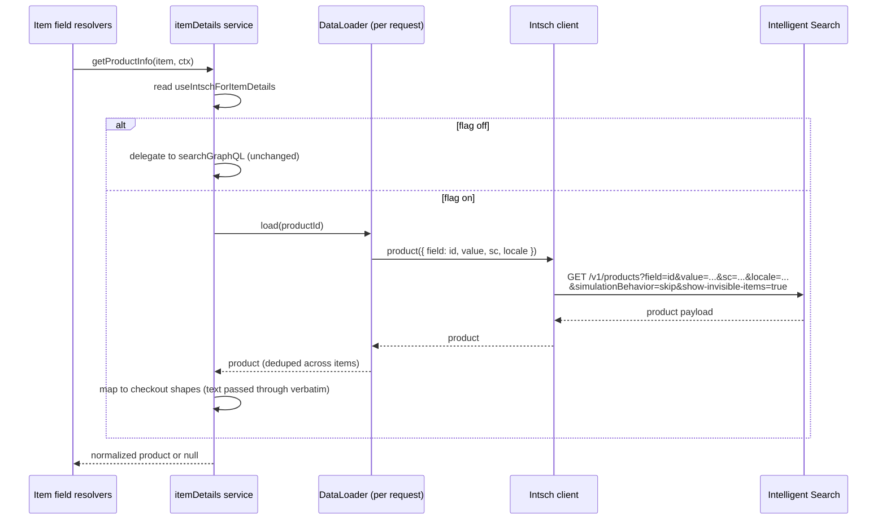
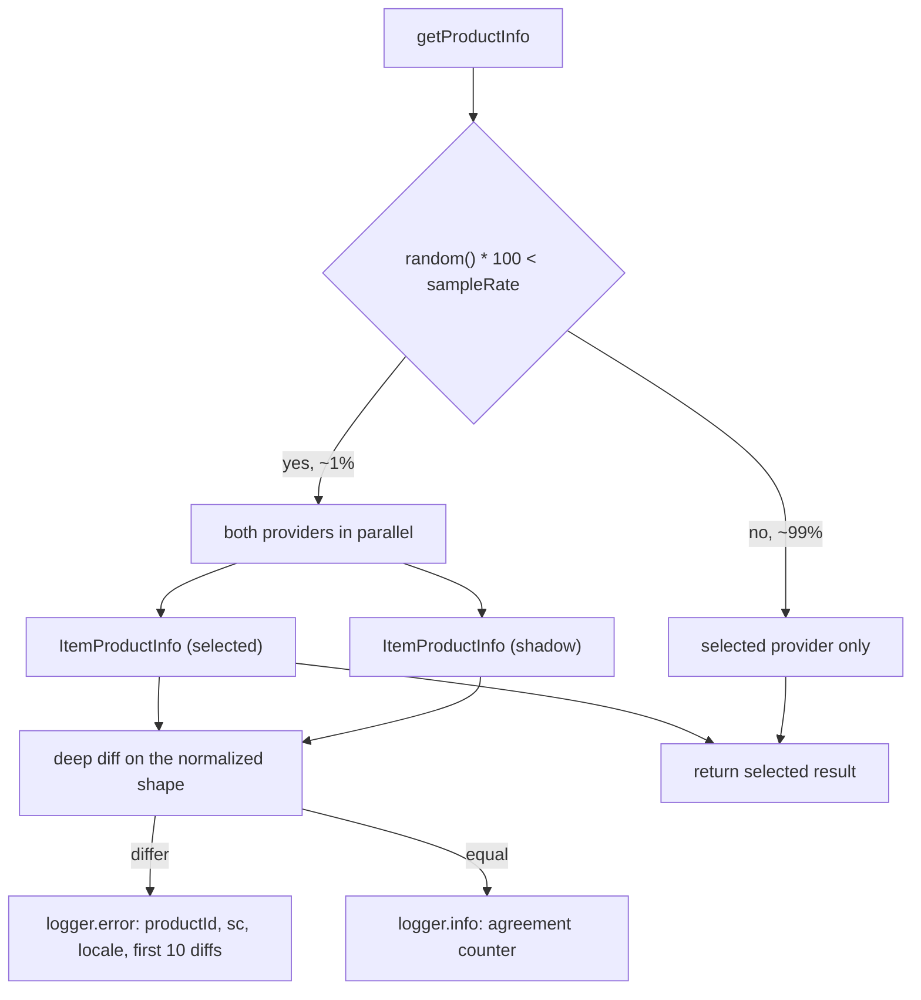

# Direct Intelligent Search integration for cart item details

> **Status**: Draft
> **Created**: 2026-08-13

## 1. Business Context

### Problem Statement

Four fields on the checkout `Item` type are not resolved from the orderForm — they come from the catalog through search:

| Field | Source today |
| --- | --- |
| `Item.name` | `productsByIdentifier.productName` |
| `Item.skuName` | `productsByIdentifier.items[].name` matching the SKU |
| `Item.skuSpecifications` | `productsByIdentifier.items[].variations` |
| `Item.productSpecificationGroups` | `productsByIdentifier.specificationGroups` |

`checkout-graphql` fetches them with a persisted GraphQL query against `vtex.search-graphql`, routed through `vtex.graphql-server`. The full request chain for a shopper opening the cart is:

```
checkout-graphql → graphql-server → search-graphql → search-resolver → intelligent-search (intsch)
```

Three of those five hops exist only to move a `productId` in and four strings out. Each hop adds latency, a timeout budget, a deploy surface, and a failure mode that `checkout-graphql` must degrade around. `search-resolver` itself already resolves `productsByIdentifier` by calling `intsch` once per product id (`GET /api/intelligent-search/v1/products`), so the extra hops add no data — only overhead.

The chain is also doing work checkout throws away. `search-resolver`'s legacy `productsByIdentifier` path hits the Catalog with SKU price simulation, and the intsch product-search family defaults to `simulationBehavior=default`, meaning the platform runs a seller-by-seller simulation to compute prices, promotions, and availability. Checkout never reads a single price from search — every monetary value on `Item` (`price`, `listPrice`, `sellingPrice`, `priceTags`, `priceDefinition`) comes from the orderForm. We are paying for simulation on every cart render and discarding the result.

### Goals

- Remove three network hops (`graphql-server`, `search-graphql`, `search-resolver`) from item detail resolution, leaving `checkout-graphql → intsch`.
- Reduce p95 latency of `orderForm` queries that select any of the four fields.
- Stop triggering catalog price/availability simulation for data checkout does not use, by sending `simulationBehavior=skip`.
- Keep the rendered text identical, including localized stores — same product names, SKU names, variations, and specification groups as today.
- Keep the public GraphQL schema byte-for-byte unchanged. No storefront or client change is required.
- Keep the dependency soft: a search failure must never fail an `orderForm` query.
- Make equivalence measurable rather than asserted: prove the two providers agree on real production traffic before flipping the flag, using a sampled shadow comparison of the mapped output.

### User Stories

#### US-1: Shopper sees unchanged item information

- **Story**: As a shopper, I want my cart to show the same product names, SKU names, and specifications as before, so that the migration is invisible to me.
- **Acceptance Criteria**:
  - **Given** a cart with items whose products exist in the catalog, **when** the storefront queries `orderForm { items { name skuName skuSpecifications { fieldName fieldValues } productSpecificationGroups { name specifications { name values } } } }` with the new integration enabled, **then** the response is equal to the response produced with the integration disabled.
  - **Given** an item whose product id returns no product from intsch, **when** the fields are requested, **then** `name` and `skuName` fall back to the orderForm values and `skuSpecifications` / `productSpecificationGroups` return empty arrays.
  - **Given** a query that selects none of the four fields, **when** the `orderForm` query runs, **then** no request is made to intsch.

#### US-2: Store on a localized binding keeps translated content

- **Story**: As a shopper on a store binding whose locale differs from the tenant locale, I want item names and specifications in my language, so that the cart stays readable.
- **Acceptance Criteria**:
  - **Given** a request with `x-vtex-locale` different from the tenant locale, **when** item details are resolved, **then** the `locale` query param sent to intsch equals the segment `cultureInfo` (falling back to `ctx.vtex.locale ?? tenant.locale`).
  - **Given** intsch returns text already localized for that `locale`, **when** the four fields are mapped, **then** the content is passed through verbatim — no translation logic is added to this app.
  - **Given** the schema's existing `@translatableV2` annotations, **when** the fields resolve, **then** they behave exactly as they do today, because they receive plain strings from this app just as they do from `search-graphql` now.

#### US-3: Operator can roll the change back without a deploy

- **Story**: As an operator, I want to disable the direct intsch integration through app settings, so that I can roll back instantly if item text regresses.
- **Acceptance Criteria**:
  - **Given** the app setting `useIntschForItemDetails` set to `false` (the initial default), **when** item details are resolved, **then** the existing `searchGraphQL` client is used and behavior is unchanged.
  - **Given** the app setting set to `true`, **when** item details are resolved, **then** only intsch is called and `searchGraphQL` is not.
  - **Given** the app settings request fails, **when** item details are resolved, **then** the resolver falls back to the `searchGraphQL` path and logs the settings error.

#### US-4: Platform stops paying for unused simulation

- **Story**: As a platform engineer, I want checkout's catalog reads to skip price simulation, so that cart rendering stops loading the simulation path for data nobody reads.
- **Acceptance Criteria**:
  - **Given** any item detail fetch, **when** the request is sent to intsch, **then** it carries `simulationBehavior=skip`.
  - **Given** a response fetched with `simulationBehavior=skip`, **when** the four fields are mapped, **then** all of them are populated, since none of them depends on simulated data.

#### US-5: Engineer has evidence the providers agree before cutting over

- **Story**: As the engineer rolling this out, I want production traffic to tell me whether intsch and `search-graphql` produce the same item details, so that I flip the flag on evidence rather than on hope.
- **Acceptance Criteria**:
  - **Given** the comparison sample rate is `1`, **when** a product's details are resolved, **then** roughly 1% of distinct products are fetched from both providers and the remaining 99% from the selected provider only.
  - **Given** a product is sampled for comparison, **when** the two results are compared, **then** the comparison runs on the normalized `ItemProductInfo` produced by each provider's mapper, never on the two raw upstream payloads.
  - **Given** the two normalized results differ, **when** the comparison completes, **then** an error-level log records the `productId`, `sc`, `locale`, and the first 10 differences with their paths.
  - **Given** the two normalized results match, **when** the comparison completes, **then** an info-level log records the match, so the agreement rate is derivable from indexed log levels.
  - **Given** a product is sampled, **when** either provider fails, **then** the shopper still receives the result from the provider that succeeded and no difference is reported.
  - **Given** the sample rate is `0`, **when** products are resolved, **then** no shadow request is made at all.

### Key Scenarios

| Scenario | Pre-conditions | Steps | Expected Result |
| --- | --- | --- | --- |
| Happy path | Flag on; cart with 3 items across 2 products; both products indexed | Storefront queries the four `Item` fields | 2 requests to `GET /v1/products` (one per distinct `productId`); all four fields populated from intsch; no call to `graphql-server` |
| Repeated product | Flag on; cart with 5 items of the same `productId` (different SKUs) | Same query | Exactly 1 request to intsch; the per-request loader serves all 5 items |
| Product not found | Flag on; item references a product removed from the catalog, or one with no SKU in the sales channel | Same query | intsch returns 404; `name` / `skuName` fall back to the orderForm values; spec fields return `[]`; the `orderForm` query still returns 200 |
| intsch times out | Flag on; intsch exceeds the 3s client timeout | Same query | Error is swallowed by `getProductInfo`; the same fallback as above; a warning is logged on ~1% of failures |
| Bundle item with null `productId` | Flag on; cart contains an assembly `bundleItems` entry with `productId: null` | Same query | No intsch request for that item; fields fall back to orderForm values |
| Locale differs from tenant | Flag on; `x-vtex-locale: en-US`, tenant locale `pt-BR`, segment `cultureInfo: en-US` | Same query | `locale=en-US` sent to intsch; the returned text is passed through verbatim and matches what `search-graphql` returns for the same request |
| Flag off | Flag off (default) | Same query | Behavior identical to today, via `searchGraphQL` |
| Private sales channel | Flag on; CallCenter operator with `storeUserAuthToken` | Same query | `VtexIdclientAutCookie` forwarded to intsch so private-channel products resolve |
| Regionalized segment | Flag on; segment carries `regionId` plus price tables, campaigns, and UTM data | Same query | The outgoing request carries only `field`, `value`, `sc`, `locale`, `simulationBehavior`, and `show-invisible-items`; `regionId` and every other segment value are absent, and all four fields still resolve |
| Product hidden after being added | Flag on; a cart item's product has `isVisible: false` | Same query | `show-invisible-items=true` suppresses the visibility 404, so `name`, `skuName`, and both specification fields resolve normally instead of falling back |
| Large cart | Flag on; 40 items across 40 distinct products | Same query | Concurrency cap of 10 bounds in-flight requests; total time stays under the resolver budget; no retries amplify the fan-out |
| Sampled for comparison | Flag off; sample rate 1; a product falls inside the sample | Same query | Both providers are called once for that product; the shopper is served the `searchGraphQL` result; the normalized results are compared and the outcome logged; other products in the same cart are unaffected |
| Sampled, results differ | Sample rate 100; intsch returns a different SKU name | Same query | Error log with `productId` and the difference at path `items[name:{itemId}].name`; the shopper still receives the selected provider's value, unchanged |
| Sampled, shadow provider fails | Sample rate 100; the non-selected provider times out | Same query | No difference is logged; the shopper receives the selected provider's result; the failure surfaces only as that client's own error metric |
| Sampled four times over | Sample rate 100; one product, one cart item, all four fields queried | Same query | The comparison runs exactly once for that product, not once per field resolution |

### Functional Requirements

1. Resolve `Item.name`, `Item.skuName`, `Item.skuSpecifications`, and `Item.productSpecificationGroups` from `GET /api/intelligent-search/v1/products?field=id&value={productId}`.
2. Send `sc` and `locale`, and only those two, derived from `ctx.vtex.segment` (already populated by the `@withSegment` directive on the `orderForm` query), plus the two constants `simulationBehavior=skip` and `show-invisible-items=true`. No other segment field — notably not `regionId` — is forwarded, and `productOriginVtex` is not sent either.
3. Batch and deduplicate by `productId` within a single GraphQL request, so a cart with N items and M distinct products issues at most M requests.
4. Forward `VtexIdclientAutCookie` from `storeUserAuthToken ?? adminUserAuthToken`, so private sales channels resolve for CallCenter.
5. Map the intsch payload to the existing GraphQL shapes. `items[].variations` already arrives as `{ name, values }` and `specificationGroups` already matches checkout's type field for field, so the mapping is a rename and a passthrough.
6. Pass all text through verbatim. Because the request carries `locale`, intsch already returns localized content, so this app adds no translation logic and leaves the schema's `@translatableV2` annotations untouched.
7. Gate the whole path behind the `useIntschForItemDetails` app setting, defaulting to `false`, keeping `searchGraphQL` as the fallback implementation.
8. Preserve the existing soft-failure contract: catch every error, log a sampled warning, and fall back to orderForm values.
9. Skip the fetch entirely when `item.productId` is absent (bundle items).
10. On a configurable percentage of distinct products (default 1%), resolve the product through *both* providers, compare the two normalized `ItemProductInfo` results, and log the outcome. Always serve the selected provider's result; the shadow result is only ever compared and discarded.
11. Compare after mapping, never before. Each provider owns a mapper to `ItemProductInfo`, and only that common shape is compared, so the diff reports real behavioral divergence rather than the unavoidable differences between the two upstream payload formats.
12. Compare arrays by identity rather than position (`items` by `itemId`, `specificationGroups` and `variations` by `name`), because neither upstream guarantees ordering and position-based diffs would be noise.

### Non-Functional Requirements

- **Timeout**: 3s per intsch request, matching the current `searchGraphQL` budget. Not the 9s `search-resolver` uses, because checkout degrades gracefully and must not hold the orderForm query.
- **Retries**: `0`. A retry multiplies a fan-out that is already one request per product.
- **Concurrency**: capped at `10` in-flight requests for the client, mirroring `search-resolver`.
- **Caching**: an `LRUCache` of 5000 entries wired as `memoryCache`, tracked via `metrics.trackCache`. Both context values that change the response (`sc`, `locale`) travel in the query string so they are part of the HTTP cache key. Keeping the param set to two values also keeps the cache hit rate high, since the key does not fragment per region.
- **Observability**: a dedicated metric name (`checkout-intsch-product`) so latency and error rate are attributable; the sampled warning must name the new upstream rather than `vtex.search-graphql`.
- **Comparison cost**: at the default 1% sample rate, the shadow path adds roughly 1% to each provider's request volume. A sampled product resolves as slowly as the slower of the two providers, since both are awaited in parallel — acceptable at 1%, and the reason the rate is a setting rather than a constant. Non-sampled resolutions must make exactly one upstream call, with no added latency.
- **Log volume**: one log line per sampled product, capped at the first 10 differences per line. Comparison logs carry `productId`, `sc`, and `locale` only — never the full payloads and no shopper data.
- **Security**: no new credentials. The auth token is only forwarded when already present on the context, as `search-resolver` does.
- **Compatibility**: the `graphql/` schema is unchanged. No breaking change, no major version.

### Out of Scope

- Changing which fields checkout exposes, or adding fields from the intsch payload (brand, `linkText`, images, clusters).
- Any price, availability, or seller data — those stay with the orderForm.
- `Item.imageUrls`, which already comes from the orderForm via `fixImageUrl`.
- Removing the `searchGraphQL` client and the `vtex.graphql-server` dependency. That is a follow-up once the flag is at 100%.
- Identifier fields other than `id` (`slug`, `ean`, `reference`, `sku`). Checkout only ever looks products up by `productId`.
- Replicating `search-resolver` behavior unrelated to these four fields: `linkText` rewriting, binding slug translation, breadcrumbs, facets, `productOriginVtex` toggling.
- Any change to translation. No translatable-string envelopes are built, no `vtex.messages` call is added or removed, and the `@translatableV2` annotations in `graphql/types/Item.graphql` stay exactly as they are. Reviewing whether those annotations are still worth keeping is a separate discussion (see Decision 5).
- Migrating to a batched `/v1/product-search` strategy (see Alternatives).

---

## 2. Arch Decisions

### Proposed Solution

Add an `Intsch` client to `checkout-graphql` that speaks directly to the Intelligent Search API, and move the catalog-text mapping that `search-resolver` performs into this app. Translation is not part of the change: the request carries `locale`, so intsch returns content already localized, exactly as it does for `search-resolver`.

The four `Item` field resolvers keep their current structure — they all funnel through a single `getProductInfo(item, ctx)` helper — but that helper now selects between two providers based on an app setting, and the shape it returns is normalized so the resolvers stay unchanged.

That normalized shape is what makes the rollout verifiable: because both providers are mappers onto the same `ItemProductInfo`, a sampled percentage of products can be resolved through both and diffed, and any difference is a real behavioral difference rather than an artifact of two payload formats.

Concretely:

1. **`node/clients/intsch.ts`** — a `JanusClient` (env `stable` in production, `beta` otherwise) exposing `product(args)` against `/api/intelligent-search/v1/products`. Registered as `clients.intsch` with the timeout/retry/concurrency/cache options above.
2. **`node/services/itemDetails.ts`** — per-request `DataLoader<string, IntschProduct>` keyed by `productId`, resolving each key with one client call. Created lazily on `ctx.state` so it is scoped to the request, not the process. This is also where the two providers are selected between and, on sampled products, compared.
3. **`node/utils/intschMapping.ts`** — maps an intsch product to the four checkout shapes, including the variations reconstruction. Pure string and array manipulation; no i18n.
4. **`node/utils/compareResults.ts`** — ported from `search-resolver`, unchanged in semantics: runs two async functions in parallel on a sampled percentage of calls, deep-diffs the results with configurable ignore patterns and identity-based array matching, logs the outcome, and returns the first function's result.
5. **`node/services/settings.ts`** — reads `useIntschForItemDetails` and `itemDetailsComparisonSampleRate` from `apps.getAppSettings('vtex.checkout-graphql@0.x')`, with a `x-vtex-force-intsch-item-details` header escape hatch for testing, mirroring `search-resolver`'s `fetchAppSettings`.
6. **`manifest.json`** — adds a `settingsSchema` for both settings and `outbound-access` policies for `/api/intelligent-search` on both `portal.vtexcommercestable.com.br` and `portal.vtexcommercebeta.com.br`.

### Architecture Overview

Today:

```mermaid
flowchart LR
  SF[Storefront] --> CG[checkout-graphql]
  CG -->|persisted query productsByIdentifier| GS[graphql-server]
  GS --> SG[search-graphql]
  SG --> SR[search-resolver]
  SR -->|GET /v1/products per id<br/>productOriginVtex=true, portal format| IS[(Intelligent Search)]
  SR -.->|@translatableV2| MSG[vtex.messages]
  CG -.->|@translatableV2| MSG
```

After:

```mermaid
flowchart LR
  SF[Storefront] --> CG[checkout-graphql]
  CG -->|GET /v1/products per id<br/>sc, locale, simulationBehavior=skip,<br/>show-invisible-items=true| IS[(Intelligent Search)]
  CG -.->|@translatableV2, unchanged| MSG[vtex.messages]
```

Resolution flow for one request:



Sampled products take both branches. The comparison sits above the two providers, so it is the same code path in either flag state — only which side is authoritative changes:



### Alternatives Considered

| Alternative | Pros | Cons | Verdict |
| --- | --- | --- | --- |
| Keep `search-graphql` (status quo) | Zero work; one batched call per cart | 4 extra hops; simulation we discard; latency and error budget spread across 3 apps we don't own | Rejected — this is the problem being solved |
| Batched `GET /v1/product-search/?query=product.id:1;2;3` | One HTTP call per cart regardless of size | Relies on full-text ID matching semantics (partial prefix matches, relevance ordering, `count`/pagination caps, unavailable-item filtering); diverges from the PDP path `search-resolver` uses, so behavior differences would be ours alone to debug | Rejected for now; revisit if fan-out proves costly |
| Call `search-resolver` directly through `graphql-server` | Removes one hop with almost no code change | Still 3 hops; still no control over `simulationBehavior`; still depends on `shouldUseNewPDPEndpoint` in another app | Rejected — insufficient gain |
| Read `productSpecificationGroups` / `skuSpecifications` straight off the orderForm | Zero extra requests; the fields exist on the checkout REST item payload | Not reliably populated across checkout configurations, not localized, and does not cover `productName` / SKU `name` — the two fields that drove this integration | Rejected as the primary source; a possible later optimization for the spec fields alone |
| Call the Catalog API directly | Full control of the payload | Reintroduces price simulation, needs new outbound policies and heavier payloads, and is the path VTEX is migrating away from | Rejected |
| Validate the cutover with fixtures and a staged rollout only, no shadow comparison | No extra requests, no extra code | Fixtures only cover the catalog shapes we thought to capture; real divergences (a locale resolved differently, a spec group filtered differently for an unavailable SKU) would surface as shopper-visible text, silently | Rejected — the failure mode is silent, which is exactly what sampling fixes |
| Compare the two raw upstream payloads instead of the mapped results | Catches upstream differences the mapper might paper over | The two payloads are different formats by construction (portal vs Intelligent Search), so nearly every field would diff; the signal would be unusable | Rejected — comparison happens after mapping |
| Compare offline, replaying production `productId`s in a script | Zero production cost or risk | Misses the context that actually varies (segment, sales channel, locale, account-specific catalog and index state), which is where the divergences live | Rejected as the primary gate; useful for debugging a reported difference |
| Write a small purpose-built deep-diff instead of porting `search-resolver`'s | Less code to carry | Loses the two affordances that make the signal usable — ignore patterns and identity-based array matching — which `search-resolver` only added after hitting the noise | Rejected — port the proven one |

### Risks & Mitigations

| Risk | Impact | Likelihood | Mitigation |
| --- | --- | --- | --- |
| Request fan-out on large carts (one call per distinct product) | Medium — slower cart for wholesale-size carts | Medium | Concurrency cap of 10, `retries: 0`, 5000-entry memory cache, per-request dedupe; the API's own 10-minute `Cache-Control` also helps at the platform edge; measure p95 by cart size during rollout and keep the batched `/product-search` strategy as the documented escape hatch |
| `productSpecificationGroups` comes back empty or partial for an item that is no longer available | Low — the field is already allowed to be empty and falls back to `[]` | Medium | Known upstream behavior, not something we control: the API builds `specificationGroups` from the catalog filtered to SKUs with `availableQuantity > 0`, falling back to the unfiltered catalog only when no SKU is available. Same today, since `search-resolver` reads the same endpoint. Capture a fixture for an unavailable SKU so the mapper is exercised against it |
| `show-invisible-items=true` surfaces catalog text for a product the merchant intended to hide | Low — only for a product already sitting in that shopper's own orderForm, and only display text | Low | Scoped by construction: the lookup is keyed by a `productId` taken from the cart, and the mapper returns nothing but names and specifications. Accepted as the point of Decision 4 |
| intsch returns text in an unexpected language because `locale` is derived differently than the current `graphqlServer` client derives it (segment `cultureInfo` vs `ctx.vtex.locale`) | Medium — wrong language on cart item text | Low | Golden-output comparison test per locale; the sampled shadow comparison catches this on real traffic as a `different_value` on every text path, which is the clearest signal the comparison produces; staged rollout starting with a single-locale account, then a multi-binding account |
| Products missing from the IS index (unindexed, inactive, or private channel) resolve to 404 | Low — falls back to orderForm text, which is what happens today on any search failure | Medium | Keep the soft-failure path; add a distinct log message for 404 vs transport error so index gaps are measurable rather than hidden |
| Missing `outbound-access` policy blocks the call in some environment | High — every fetch fails | Low | Add both `vtexcommercestable` and `vtexcommercebeta` hosts, matching `search-resolver`; verify in a workspace before rollout since `beta` is the non-production Janus env |
| Cache poisoning across sales channel or locale | High — wrong text or wrong channel's data served | Low | Both discriminating values travel as query params so they are part of the HTTP cache key; no context is passed via headers except auth |
| Omitting `regionId` changes which product or SKUs resolve on a regionalized account | Low — the four fields are catalog text, not regional availability | Low | Golden-output comparison on a regionalized account during Phase 6, where the sampled shadow comparison is the mechanism that would surface it; the fallback to orderForm text already covers a product that fails to resolve |
| The mapper is written against the wrong response format, because `search-resolver`'s equivalent code targets the portal format | Medium — empty `skuSpecifications` and missing spec groups | Low | Decision 3 pins the format; the fixture must be captured without `productOriginVtex`, and the mapper is typed against `IntelligentSearchProduct` rather than copied from `sku.ts` |
| Comparison noise drowns the signal — ordering, or SKUs present in one provider and not the other — and the diff logs get ignored | Medium — the rollout gate becomes meaningless | Medium | Identity-based array matching for `items`, `specificationGroups`, and `variations`; a reviewed `ignoredDifferences` list that starts empty and only grows with a written justification per entry; tune at 100% sample rate in a workspace before enabling in production |
| The comparison itself breaks the shopper's request — an exception in the diff, or the shadow provider's failure propagating | High — cart text lost, or worse, a failed field | Low | The comparator catches per-side failures and returns the surviving result, only throwing when both fail, and that throw lands in the existing soft-failure catch that falls back to orderForm values; the diff itself runs inside a try/catch that logs and moves on |
| Sampling multiplies unexpectedly, because `getProductInfo` is called once per field per item (up to 4 × N) | Medium — 4×+ the intended shadow traffic and duplicated logs | Medium | The comparison lives at the per-request, per-`productId` memoization boundary, not in the resolvers; covered by an explicit test that four field resolutions on one product produce exactly one comparison |
| Comparison traffic runs against production during a high-traffic window | Low — 1% of an already small volume | Low | Sample rate is an app setting, changeable to `0` without a deploy, and is the first thing to reach for if either upstream shows strain |

### Key Decisions

#### Decision 1: Fetch per product id via `GET /v1/products`, not batched `/product-search`

- **Status**: Accepted
- **Context**: intsch offers a PDP endpoint that takes a single identifier and a PLP endpoint that takes a query and facet path. `search-resolver` resolves `productsByIdentifier` with N parallel calls to the PDP endpoint; filtering by product id on the PLP endpoint is only possible through full-text ID syntax (`q=product.id:...`).
- **Decision**: Use `GET /api/intelligent-search/v1/products?field=id&value={productId}`, one call per distinct product id, deduped and bounded by concurrency.
- **Consequences**: Behavior matches the path `search-resolver` already exercises in production, so payload shape and edge cases are known. The cost is request fan-out proportional to distinct products in the cart, mitigated by dedupe, caching, and a concurrency cap. The client is deliberately shaped so a batched provider can be added behind the same service interface without touching resolvers.

#### Decision 2: Always send `simulationBehavior=skip`

- **Status**: Accepted
- **Context**: The param is an enum (`default | skip | only1P | only3P | regionalize1p`), not a boolean, and it defaults to `default` on the endpoint — the handler reads `query.simulation_behavior.unwrap_or(SimulationBehavior::Default)`, so it must be sent explicitly. It is fully supported on `/v1/products`, not only on `/product-search`: the endpoint's own test suite exercises `simulationBehavior=skip` extensively. `skip` means the platform never calls SKU simulation, which is exactly "don't compute prices". Checkout reads every price from the orderForm.
- **Decision**: Send `simulationBehavior=skip` on every item detail fetch, unconditionally and not configurable.
- **Consequences**: Removes the per-SKU checkout simulation from the cart render path. Offers are then served from the cached `sku_offer` instead — the `OfferOrigin` enum documents `SkuOffer` as the value used "when there is no usable live simulation result for a SKU, whether because `simulationBehavior=skip` was requested or because the simulation call failed" — so prices, promotions, teasers, and `availableQuantity` are stale rather than absent. Both are fine here, because reading any of them would be a bug; the mapper's output type carries no commercial-offer field. One second-order effect is worth knowing: cached availability still feeds the availability filter the API applies when building `specificationGroups` (see Risks).

#### Decision 3: Omit `productOriginVtex`, which selects the response format

- **Status**: Accepted
- **Context**: `productOriginVtex` is not a hint — it switches the serialized response type. In `intelligent-search-api`, the handler resolves `ProductOrigin::from_query_param(query.product_origin_vtex)` and `convert_product` returns either `SearchProductOutput::IntelligentSearch(IntelligentSearchProduct)` or `SearchProductOutput::CatalogSearch(PortalSearchProduct)`. The two formats differ in exactly the places checkout reads: `SearchItem.variations` is `Vec<Variation>` (`{ name, values }`) while `PortalItem.variations` is `Vec<String>` with the values flattened onto the item as dynamic keys; and `IntelligentSearchProduct` has `specification_groups: Vec<SpecificationGroup>` while `PortalSearchProduct` has no equivalent, offering only `all_specifications_groups: Vec<String>` and `complete_specifications`. `search-resolver` sends `productOriginVtex: true`, which is why its `sku.ts` performs a dynamic-key lookup and why its typings describe variations as a string array.
- **Decision**: Do not send `productOriginVtex`. Consume the default Intelligent Search format.
- **Consequences**: This is what makes the mapping trivial rather than merely simpler — structured `variations` and a `specificationGroups` shape that matches checkout's GraphQL type field for field. It also means we must not copy `search-resolver`'s `sku.ts` verbatim, because that code is written against the portal format; the dynamic-key lookup would find nothing here. The mapper is therefore written against `IntelligentSearchProduct` and its fixture must be captured without the flag.

#### Decision 4: Send `show-invisible-items=true`

- **Status**: Accepted
- **Context**: The endpoint runs a catalog visibility check and answers 404 when the product's `isVisible` is false, unless `show-invisible-items=true` is passed. That default is right for a storefront — an invisible product should not appear in search results or on a PDP — but it is wrong for a cart. A shopper can add a product and then have a merchant hide it; the item is still in their orderForm and still needs a name. Under the default we would take the 404 path and silently fall back to the orderForm's stored `name` and `skuName`, losing the specification fields entirely.
- **Decision**: Send `show-invisible-items=true` on every item detail fetch, unconditionally, alongside `simulationBehavior=skip`.
- **Consequences**: An item already in the cart keeps rendering its full catalog text after the product is hidden, which is the behavior a shopper expects and is strictly better than the fallback. This does not create an exposure: the product is only reachable because it is already in the shopper's own orderForm, we read nothing but display text, and no new field is exposed on the GraphQL schema. It narrows the remaining 404 causes to a genuinely missing product or one with no SKU in the sales channel, which makes the 404 log line a more useful signal about index gaps. Note this is a deliberate divergence from `search-resolver`, which does not send the flag — appropriate, because its callers are storefront surfaces and ours is a cart.

#### Decision 5: Add no translation logic; `locale` on the request is the whole mechanism

- **Status**: Accepted
- **Context**: intsch returns catalog text already localized for the `locale` it is given — that is why `search-resolver` passes `locale` on every call and then declines to translate intsch content itself. `search-resolver` still wraps strings in `formatTranslatableStringV2` envelopes with `state = 'translated'`, but that exists only to tell the `@translatableV2` directive in the `search-graphql` schema to leave the content alone. Since `checkout-graphql` will be reading the localized text directly, there is nothing to suppress and nothing to translate.
- **Decision**: Pass all text through verbatim. Do not port `addContextToTranslatableString`, do not add a `translated` flag to the context, do not build envelopes, and do not touch the `@translatableV2` annotations already in `graphql/types/Item.graphql`. Correct localization is achieved solely by sending the right `locale` (Decision 8).
- **Consequences**: This removes an entire subsystem from the change — no i18n utility, no context flag, no per-locale envelope tests — and removes the only behavioral delta the earlier design carried. The schema's `@translatableV2` annotations keep receiving plain strings from this app exactly as they receive plain strings from `search-graphql` today, so their behavior is unchanged and the second `vtex.messages` pass they perform is neither added nor removed here. That pass is arguably redundant now that content arrives pre-localized; removing the annotations would be a user-visible change to translation behavior and belongs in its own spec, not this migration. It also means the mapper ignores the product-level `skuSpecifications`, which existed only to supply a message context id — an id this endpoint's model does not even carry.

#### Decision 6: Feature flag through app settings, `searchGraphQL` retained as fallback

- **Status**: Accepted
- **Context**: This swaps the data source for shopper-visible text in the cart. `search-resolver` manages the equivalent risk with `shouldUseNewPDPEndpoint` / `shouldUseNewPLPEndpoint` app settings plus force headers.
- **Decision**: Add a `settingsSchema` to `manifest.json` with `useIntschForItemDetails` (default `false`), read it through `apps.getAppSettings`, honor an `x-vtex-force-intsch-item-details: true` header override, and fall back to the `searchGraphQL` path when the setting is off or unreadable.
- **Consequences**: Instant rollback without a deploy, and A/B comparison in the same workspace. Both providers coexist for the duration of the rollout, which means both must be kept working and tested. The `searchGraphQL` client, the `vtex.graphql-server` dependency, and the `resolve-graphql` policy are removed in a separate follow-up once the flag reaches 100%.

#### Decision 7: Validate the cutover with a sampled shadow comparison of the mapped results

- **Status**: Accepted
- **Context**: A feature flag makes the change reversible, but it does not make it verifiable — flipping it and watching error rates would only catch failures, not wrong answers. The dangerous failure mode here is a silent one: text that resolves successfully but differs from what shoppers see today, in a locale, a sales channel, or an availability state that no fixture covers. `search-resolver` faced the identical problem migrating to intsch and solved it with `compareApiResults`: run both implementations in parallel on a sampled percentage of traffic, deep-diff the results, and log whether they agree. The utility carries two affordances it earned the hard way — identity-based array matching, and an `ignoredDifferences` list of path patterns — that only exist because a naive diff produced unusable noise.
- **Decision**: Port `search-resolver`'s `node/utils/compareResults.ts` into this app and use it at the per-`productId` resolution boundary. Sample rate comes from an `itemDetailsComparisonSampleRate` app setting, `0`–`100`, defaulting to `1`. The first function is the provider selected by `useIntschForItemDetails` and its result is always the one served; the second is the other provider, whose result is compared and discarded. The comparison operates on the normalized `ItemProductInfo` that each provider's mapper produces — never on the two raw upstream payloads, which are different formats by construction and would diff on nearly every field. Arrays are matched by identity: `items` by `itemId`, `specificationGroups` and `variations` by `name`. `ignoredDifferences` starts empty; every entry added needs a written justification, because each one is a difference we are choosing not to see.
- **Consequences**: The rollout gate becomes a number — the ratio of info-level to error-level comparison logs — rather than a judgment call, and the same mechanism keeps working after the flip, since the comparison is indifferent to which provider is authoritative and will catch a regression in the new path just as readily. The costs are real but bounded: 1% extra volume on both upstreams, sampled products resolving as slowly as the slower provider, and both providers having to stay working and tested for the duration. Placement matters more than it looks — `getProductInfo` is called once per field per item, so the comparison must sit at the per-request, per-`productId` memoization boundary or a single four-field item would trigger four comparisons and four shadow calls. Porting rather than sharing means this app carries a copy that can drift from `search-resolver`'s; acceptable, because both copies are deleted when their respective migrations finish, and the file is self-contained with no dependency beyond `@vtex/api`'s `Logger`.

#### Decision 8: Extract only sales channel and locale from the segment

- **Status**: Accepted
- **Context**: The `orderForm` query already carries `@withSegment`, so `ctx.vtex.segment` holds `channel`, `cultureInfo`, `regionId`, and a long tail of personalization data (price tables, campaigns, UTM, delivery zone and pickup point hashes, coordinates, postal code). `search-resolver` forwards a wide slice of that to intsch because it resolves prices, availability, and regionalized sellers. Checkout resolves none of those — it needs four strings of catalog text — and `simulationBehavior=skip` already removes simulation from the picture.
- **Decision**: Read exactly two values from the segment: `sc` from `segment.channel` and `locale` from `segment.cultureInfo ?? ctx.vtex.locale ?? tenant.locale`. Forward nothing else. In particular, do not send `regionId`, even though `search-resolver`'s PDP path does. Always send `sc` explicitly rather than relying on the API resolving it from the caller's segment, because the endpoint answers 400 when it can find a sales channel from neither source.
- **Consequences**: The request carries the minimum that can change the answer, which keeps the memory cache key narrow and the hit rate high — a regionalized account does not fragment the cache per region. It also keeps the client's argument surface small enough that a future batched provider is a drop-in. The trade-off is that on a regionalized account we no longer ask for the region's view of the product; that only matters if a product resolves for one region and not another, in which case the item falls back to orderForm text exactly as it does for any unresolved product. Verify this on a regionalized account during Phase 6, using the sampled comparison rather than by inspection. As with the current `search-graphql` integration, `sc` comes from the shopper's segment rather than the orderForm's own `salesChannel`, so a drifted segment can disagree with the cart; that is pre-existing behavior, not a regression, and threading the orderForm through would be a larger change because the `Item` resolvers do not receive the orderForm root.

#### Decision 9: Failure handling stays soft and silent

- **Status**: Accepted
- **Context**: `getProductInfo` currently swallows every error, logs a warning on ~1% of failures to avoid flooding, and returns `null`, letting the resolvers fall back to orderForm values and empty arrays.
- **Decision**: Keep that contract unchanged, updating only the log message to name intsch, and distinguishing a 404 from a transport error so index gaps are measurable. With `show-invisible-items=true` in place (Decision 4), a 404 now means the product is genuinely absent or has no SKU in the sales channel, which makes that signal worth acting on.
- **Consequences**: The cart never breaks because search is down. The risk — silent quality degradation — is the same one that exists today, now with slightly better signal, and Decision 7's sampled comparison is what turns that residual risk into something measurable. The contract also absorbs the comparator: it throws only when both providers fail, and that throw lands in this same catch.

### Implementation Plan

**Phase 0 — Fixture capture (no production code)**

The response contract is settled from `intelligent-search-api` source rather than assumed, so this phase is now narrow. Against a real account in a dev workspace, call `GET /api/intelligent-search/v1/products?field=id&value={id}&sc=1&locale={locale}&simulationBehavior=skip` and:

- Capture the payload as the test fixture, for a product with multi-dimension SKU variations and at least one specification group. Append `show-invisible-items=true`, matching what the client will send.
- Capture a second fixture for a product with an unavailable SKU, to pin the availability-filtered `specificationGroups` behavior.
- Confirm the text comes back in the requested `locale` by running the same call with two locales on a localized account.
- Record the latency, to have a baseline for the rollout comparison.

**Phase 1 — Client and app plumbing**

`node/clients/intsch.ts`, registration in `node/clients/index.ts`, options in `node/index.ts` (3s timeout, `retries: 0`, `concurrency: 10`, 5000-entry `memoryCache` with `metrics.trackCache`), and the two `outbound-access` policies plus the `settingsSchema` in `manifest.json`.

**Phase 2 — Mapping utility**

`node/utils/intschMapping.ts` — the four mappers, typed against `IntelligentSearchProduct`. Deliberately not copied from `search-resolver`'s `sku.ts`, which targets the portal format (Decision 3).

**Phase 3 — Service and resolver wiring**

`node/services/settings.ts`, `node/services/itemDetails.ts` (loader + provider selection), and `node/resolvers/items.ts` refactored so `getProductInfo` delegates to the service while the four resolvers keep their current bodies. The key structural requirement of this phase is that both providers are exposed as `(productId) => Promise<ItemProductInfo | null>` behind the same interface, which is what Phase 4 needs; the `searchGraphQL` side therefore gets an explicit mapper to `ItemProductInfo` instead of returning its payload shape directly.

**Phase 4 — Shadow comparison**

Port `node/utils/compareResults.ts` and its test file from `search-resolver`, trimming what this app does not use. Add `itemDetailsComparisonSampleRate` to the settings service and `settingsSchema`. Wire `compareApiResults` into the per-`productId` boundary in `itemDetails.ts` with the identity-matching config, and confirm on a workspace at 100% sample rate that a same-product resolution reports no differences before enabling anywhere else. Tune `ignoredDifferences` here, at 100%, where noise is cheap to observe — not in production.

**Phase 5 — Tests**

A new `node/__tests__/items-product-info.test.ts` plus an intsch fixture, covering: field mapping per resolver, dedupe (N items → M calls), 404 and timeout fallbacks, missing `productId`, the `locale` sent for a given segment, the exact outgoing param set from a segment rich in personalization data (asserting `show-invisible-items=true` is present), and flag on/off parity against the `searchGraphQL` mock. For the comparison path specifically: that both providers are mapped to `ItemProductInfo` before the diff; that reordered `items` and `specificationGroups` produce no difference while reordered specification `values` do; that a changed SKU name produces one difference at the expected path; that a shadow-provider failure is not reported as a difference and does not affect the served result; that four field resolutions on one product trigger exactly one comparison; and that a sample rate of `0` issues no shadow call.

**Phase 6 — Rollout**

Enable in a dev workspace via the force header; then one single-locale account; then one multi-binding localized account; then one regionalized account, to confirm that omitting `regionId` does not change the four fields; then broad enablement. Watch the new metric's latency and error rate, cart-render p95 by cart size, and the item-detail warning rate at each step.

The gate at each step is the comparison signal, read from the ratio of `Results are equal` to `Results differ` log lines: leave the flag off, let the sample accumulate on that account's real traffic, and only flip once the agreement rate holds at 100% over a meaningful volume, with every observed difference either fixed or explicitly justified in `ignoredDifferences`. After the flip, the comparison keeps running with the providers swapped, so the same signal now guards against a regression in the intsch path.

**Phase 7 — Cleanup (follow-up, separate PR)**

Remove `node/clients/searchGraphQL/`, `node/clients/graphqlServer.ts` if unused elsewhere, the `vtex.graphql-server` dependency and `resolve-graphql` policy, the `searchGraphQL` cache in `node/index.ts`, both settings, and — since it has nothing left to compare against — `node/utils/compareResults.ts` with its config and tests.

---

## 3. Technical Contract

### Data Models

The response body is a single bare product object — no `{ products: [...] }` envelope — serialized from `IntelligentSearchProduct` in `intelligent-search-api/src/models/services/search.rs`. Only the fields checkout consumes are modeled below; everything else (`sellers`, `commertialOffer`, `priceRange`, `images`, `properties`, `clusterHighlights`, `categories`, `link`, `description`) is intentionally left untyped and unused.

All text arrives already localized for the `locale` on the request, so every string is consumed as-is.

```ts
interface IntschProduct {
  productId: string
  productName: string
  items: IntschItem[]
  specificationGroups: IntschSpecificationGroup[]
  /** Always the literal "intsch" on this endpoint; not consumed. */
  origin: string
}

interface IntschItem {
  itemId: string
  name: string
  nameComplete: string
  /**
   * Structured, and already the shape checkout needs. Serialized from the
   * Rust `Variation { name, values }`. Not a string array: that is the
   * portal/catalog format, which this endpoint only returns when
   * productOriginVtex=true (Decision 3).
   */
  variations: Array<{ name: string; values: string[] }>
}

/** Field-for-field identical to checkout's ProductSpecificationGroups type. */
interface IntschSpecificationGroup {
  originalName: string
  name: string
  specifications: Array<{ originalName: string; name: string; values: string[] }>
}
```

The product-level `skuSpecifications` array exists on the response (`{ field: { name, originalName }, values: [{ name, originalName }] }`) but is not consumed. `search-resolver` reads it to recover a `field.id` for use as a `vtex.messages` context; that id is not even present on this endpoint's model, and checkout builds no messages.

Normalized product returned by the service layer, so resolvers are provider-agnostic:

```ts
interface ItemProductInfo {
  productId: string
  productName: string
  items: Array<{
    itemId: string
    name: string
    variations: Array<{ name: string; values: string[] }>
  }>
  specificationGroups: IntschSpecificationGroup[]
}
```

App settings:

```ts
interface CheckoutGraphQLSettings {
  useIntschForItemDetails: boolean // manifest default: false
  /** Percentage of distinct products resolved through both providers, 0-100. */
  itemDetailsComparisonSampleRate: number // manifest default: 1
}
```

`ItemProductInfo` is the comparison unit as well as the resolver contract. Both providers must produce it through an explicit mapper, so the diff sees one shape:

```ts
type ItemDetailsProvider = (productId: string) => Promise<ItemProductInfo | null>
```

No change to `CustomContext` or `CustomIOContext` is required.

### Interfaces

**Client** — `node/clients/intsch.ts`

```ts
interface FetchProductArgs {
  field: 'id'
  value: string
  /** From segment.channel; the only two context values we forward. */
  salesChannel?: string
  locale?: string
}

class Intsch extends JanusClient {
  // env: 'stable' when ctx.production, otherwise 'beta'
  product(args: FetchProductArgs): Promise<IntschProduct>
}
```

HTTP contract:

```
GET /api/intelligent-search/v1/products
  ?field=id
  &value={productId}
  &sc={segment.channel ?? 1}
  &locale={segment.cultureInfo ?? ctx.vtex.locale ?? tenant.locale}
  &simulationBehavior=skip
  &show-invisible-items=true

Six params, no more. `simulationBehavior` and `show-invisible-items` are
constants (Decisions 2 and 4), not client arguments. regionId and the rest of
the segment are deliberately omitted (Decision 8). productOriginVtex is
omitted because sending it would switch the response to the portal/catalog
format (Decision 3). `locale` is what makes the response localized; there is
no other translation mechanism (Decision 5).

Response: a single bare IntelligentSearchProduct object. 404 when the product
does not exist or has no SKU in the sales channel; the `isVisible` 404 is
suppressed by `show-invisible-items`. The API sets Cache-Control for 10
minutes on public sales channels and suppresses caching on private ones.

Headers:
  VtexIdclientAutCookie: {storeUserAuthToken ?? adminUserAuthToken}   // only when present

metric: checkout-intsch-product
```

**Service** — `node/services/itemDetails.ts`

```ts
/** Replaces the current getProductInfo in node/resolvers/items.ts. */
function getProductInfo(
  item: OrderFormItem,
  ctx: Context
): Promise<ItemProductInfo | null>
```

Contract: never throws; returns `null` when `item.productId` is falsy, when the product is not found, or on any upstream error. Selects the provider from `useIntschForItemDetails`. Holds the per-request `DataLoader<string, IntschProduct>` on `ctx.state`.

Resolution for one `productId`, memoized per request so it runs once regardless of how many items or fields reference the product:

```ts
const [primary, shadow] = useIntsch
  ? [intschProvider, searchGraphQLProvider]
  : [searchGraphQLProvider, intschProvider]

return compareApiResults(
  () => primary(productId),
  () => shadow(productId),
  settings.itemDetailsComparisonSampleRate,
  ctx.vtex.logger,
  {
    logPrefix: 'ItemDetails Comparison',
    args: { productId, sc, locale, provider: useIntsch ? 'intsch' : 'searchGraphQL' },
    existenceCompareFields: [
      { path: 'items', key: 'itemId' },
      { path: 'items[*].variations', key: 'name' },
      { path: 'specificationGroups', key: 'name' },
      { path: 'specificationGroups[*].specifications', key: 'name' },
    ],
    ignoredDifferences: [], // grows only with a written justification
  }
)
```

Note what is *not* in `existenceCompareFields`: the leaf `values: string[]` arrays. Their order reaches the shopper — it is the order specification values render in the cart — so an ordering difference there is a real difference and is compared positionally. Object arrays are matched by key only because neither upstream promises an ordering for them and, unlike leaf values, their position is not what the resolvers read. Missing or extra elements are still reported under key matching, so nothing is hidden by it.

**Comparator** — `node/utils/compareResults.ts`, ported from `search-resolver`

```ts
function compareApiResults<T>(
  func1: () => Promise<T>,   // selected provider; its result is what is served
  func2: () => Promise<T>,   // shadow provider; result compared, then discarded
  sample: number,            // 0-100
  logger: Logger,
  options?: {
    args?: unknown
    logPrefix?: string
    ignoredDifferences?: IgnoredDifference[]
    existenceCompareFields?: ExistenceComparePattern[]
  }
): Promise<T>
```

Behavior that this design depends on, all of it already true of the `search-resolver` implementation:

- `Math.random() * 100 < sample` decides per call. Outside the sample, only `func1` runs, so there is no added latency and no second request.
- Inside the sample, both run under `Promise.all`, so the call takes as long as the slower side.
- Each side's rejection is captured rather than propagated. No difference is reported when either side failed. `func1`'s result is returned if it succeeded, `func2`'s if only `func1` failed, and it throws only when both failed — which the caller's existing catch turns into the orderForm fallback.
- The diff itself is wrapped: an exception while comparing is logged and treated as no difference.
- Differences are logged at `error` level with at most the first 10 entries; matches are logged at `info` level, deliberately, so the agreement rate is derivable from indexed log levels without a custom metric.
- `existenceCompareFields` matches array elements by key instead of position; `ignoredDifferences` filters by path pattern with `[*]` and `*` wildcards, optionally narrowed to one difference type.

**Settings** — `node/services/settings.ts`

```ts
function fetchAppSettings(ctx: Context): Promise<CheckoutGraphQLSettings>
```

Reads `vtex.checkout-graphql@0.x`, honors `x-vtex-force-intsch-item-details: true`, and on error logs and returns the safe defaults `{ useIntschForItemDetails: false, itemDetailsComparisonSampleRate: 0 }` — sampling off rather than on, so an unreadable setting cannot add traffic. Read once per request and reused for every item.

**Resolver mapping** — the contract the four `Item` resolvers must satisfy, unchanged in signature and fallback:

| GraphQL field | Value | Fallback when product is `null` |
| --- | --- | --- |
| `Item.name` | `product.productName` | `item.name` |
| `Item.skuName` | `product.items.find(i => i.itemId === item.id)?.name` | `item.skuName` |
| `Item.skuSpecifications` | matched SKU's `variations`, renamed to `{ fieldName, fieldValues }` | `[]` |
| `Item.productSpecificationGroups` | `product.specificationGroups` | `[]` |

The variations mapping is a pure rename, because `IntelligentSearchProduct` already delivers `{ name, values }`:

```ts
variations.map(({ name, values }) => ({ fieldName: name, fieldValues: values ?? [] }))
```

That is the same expression the current resolver applies to the `search-graphql` payload, so this field needs no new logic at all.

### Integration Points

| System | Direction | Contract |
| --- | --- | --- |
| Intelligent Search (`portal.vtexcommerce{stable,beta}.com.br`) | outbound HTTP | `GET /api/intelligent-search/v1/products` as specified above, consuming the default `IntelligentSearchProduct` format; requires two new `outbound-access` policies |
| `vtex.messages` | outbound, via `@translatableV2` | Untouched. This app builds no translatable-string envelopes and adds no messages call; the existing directive annotations receive plain strings from intsch just as they receive plain strings from `search-graphql` today. No manifest dependency or policy change |
| `vtex.apps` (`apps.getAppSettings`) | outbound | Reads this app's own settings; the client is already in use for `vtex.store@2.x` |
| Segment (`@withSegment` directive) | inbound context | Only `channel` and `cultureInfo` are read; already applied to the `orderForm` query and mutations |
| `vtex.graphql-server` / `vtex.search-graphql` | outbound, legacy | Retained while the flag rolls out, both as the fallback provider and as the comparison baseline; removed in Phase 7 |
| Storefront GraphQL consumers | inbound | No change. The `graphql/` schema is untouched |

### Invariants & Constraints

1. The public GraphQL schema does not change. Any diff under `graphql/` is a defect in this change.
2. An item detail failure never fails an `orderForm` query. Every upstream call is wrapped, and every field has a defined fallback.
3. No monetary or availability value ever originates from intsch. `simulationBehavior=skip` makes those response fields untrustworthy by design, and the mapper's output type does not carry them.
4. At most one intsch request per distinct `productId` per GraphQL request.
5. No intsch request is made when the query selects none of the four fields, nor for items without a `productId`.
6. The request carries exactly six query params: `field`, `value`, `sc`, `locale`, `simulationBehavior`, `show-invisible-items`. The last two are constants; every value that can change the response is among the six, so the memory cache key is complete. Context must never be passed by header except the auth token.
7. `sc` and `locale` are the only two values read from the segment. Adding a third requires revisiting the cache key and Decision 8, because each additional discriminator fragments the memory cache.
8. Exactly one provider runs per distinct `productId`, except for products drawn into the comparison sample, which run both exactly once. Four field resolutions on one product must never produce more than one comparison.
9. What the shopper receives never depends on the comparison. The shadow result is compared and discarded, the served result is always the selected provider's, and the only path where the shadow result reaches a shopper is when the selected provider failed — which is strictly better than the `null` fallback that would otherwise apply.
10. The comparison operates on `ItemProductInfo` only. Diffing raw provider payloads is a defect, not a stricter check.
11. Comparison logs carry `productId`, `sc`, `locale`, and difference paths — never full payloads, never shopper data.
12. Text from intsch is never rewritten. No translatable-string envelope is built, no `vtex.messages` call is made from the mapping layer, and the `@translatableV2` annotations in `graphql/types/Item.graphql` are not edited.
13. Localization comes only from the `locale` query param. Any future provider added behind `getProductInfo` must localize server-side the same way, because there is no fallback translation path in this app.
14. `retries` stays at `0` for this client while the per-product fan-out strategy is in place.
